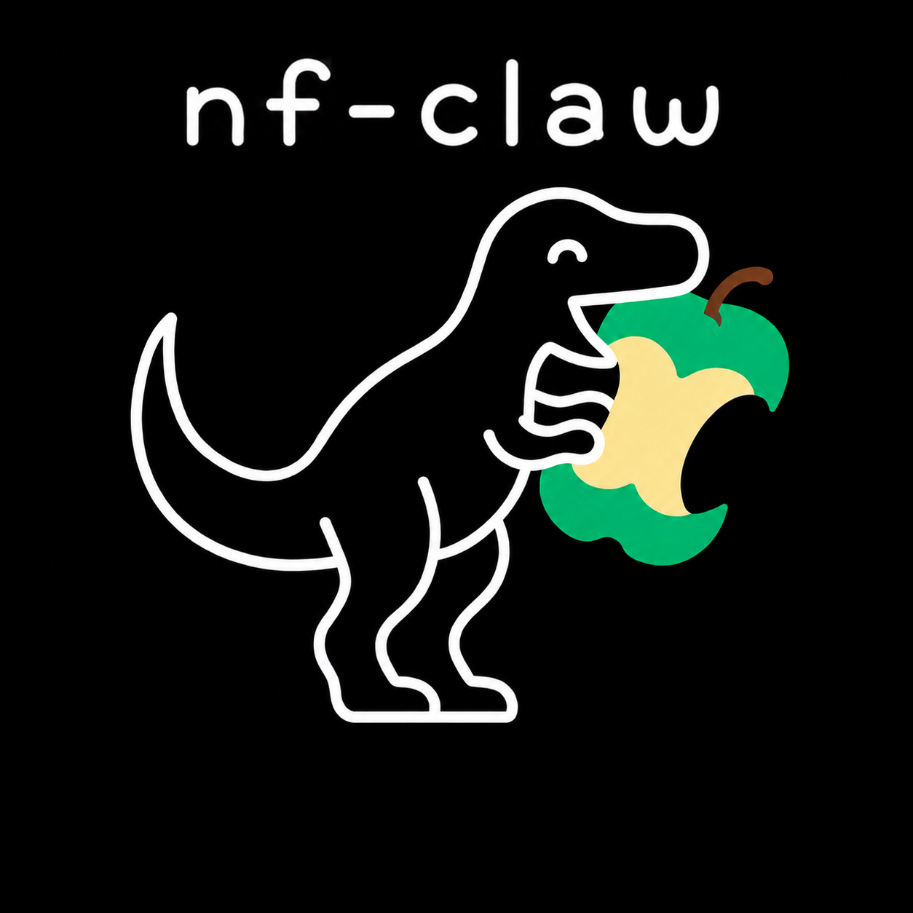

<p align="center">
  
</p>

# nf-claw

A self-maintaining, token-minimal library of [nf-core](https://nf-co.re) pipelines for AI agents.
Each pipeline is a git submodule plus an auto-generated `skill.md` an agent reads to run it
correctly — no external lookups, no hallucinated flags.

## Layout
- `pipelines/<name>/` — `upstream/` (submodule, pinned to a release) + generated `skill.md` (run command, inputs and required parameters with their allowed values and constraints, plus a map of parameter groups) and `reference.md` (every parameter, with required/hidden flags, allowed values, value constraints and default)
- `runner/` — the `nfclaw` runtime (run a pipeline); the agent's tool
- `librarian/` — builds the context files and bumps submodules (run via `make`)
- `catalog.md` / `catalog.json` — the index of available pipelines
- `sources.tsv` — the source list (name, url, version policy)

Design details (the three zones and how generation stays drift-free): [`docs/architecture.md`](docs/architecture.md).

## Use
```bash
nfclaw list                  # or: python -m runner list
nfclaw run rnaseq --input samplesheet.csv --outdir results -profile docker
```

## Maintain
```bash
make build     # regenerate skill.md/reference.md/catalog from the submodules
make update    # bump submodules to the latest release tag, then rebuild
make check     # drift gate + tests
make test
```

## Add pipelines (scales to all ~150 nf-core pipelines)
Append a line to `sources.tsv` (`name<TAB>url<TAB>latest-release`), then:
```bash
git submodule add <url> pipelines/<name>/upstream
make build
```
Full step-by-step, with the version-policy column and the checks to run, is in [`CONTRIBUTING.md`](CONTRIBUTING.md).

## How it stays current
`.github/workflows/auto-update.yml` runs on a schedule: it finds each pipeline's newest release
with `git ls-remote --tags` (pure git, no APIs), checks it out, regenerates context, and opens a PR.
The drift gate guarantees committed context always matches the pinned submodule. More detail:
[`docs/updating.md`](docs/updating.md).

## Citation & attribution
**The pipelines themselves are the work of the [nf-core](https://nf-co.re) community** — the heart of the library — and are wrapped **unmodified** as pinned git submodules; each keeps its own authors, license and citation. **nf-claw** (the wrapper/runtime) was created by **Danilo Monge** (Eberhard Karls Universität Tübingen), and **adapts some files and its repository structure from [ClawBio](https://clawbio.ai)** — created by **Manuel Corpas** (MIT; copyright retained in [`LICENSE`](LICENSE), provenance in [`NOTICE`](NOTICE)).

If you use nf-claw, cite it via [`CITATION.cff`](CITATION.cff), together with the tools it builds on:
- **Nextflow** (workflow engine) — Di Tommaso P, *et al.* Nextflow enables reproducible computational workflows. *Nat Biotechnol* **35**, 316–319 (2017). [doi:10.1038/nbt.3820](https://doi.org/10.1038/nbt.3820)
- **nf-core** (the original pipelines) — Ewels PA, *et al.* The nf-core framework for community-curated bioinformatics pipelines. *Nat Biotechnol* **38**, 276–278 (2020). [doi:10.1038/s41587-020-0439-x](https://doi.org/10.1038/s41587-020-0439-x)
- the **specific pipeline** you ran — each lists its own reference in `pipelines/<name>/upstream/CITATIONS.md`
- **ClawBio** (the predecessor nf-claw adapts files and structure from, by Manuel Corpas) — Corpas M. ClawBio: Bioinformatics-Native AI Agent Skill Library. Zenodo (2026). [doi:10.5281/zenodo.19420648](https://doi.org/10.5281/zenodo.19420648)

nf-claw is MIT-licensed and includes parts adapted from ClawBio (© Manuel Corpas, MIT — see [`LICENSE`](LICENSE) and [`NOTICE`](NOTICE)); the nf-core pipelines it wraps are MIT, and Nextflow is Apache-2.0.

Requires: Python 3.11+, git, Nextflow (Java 17+), Docker/Singularity.
