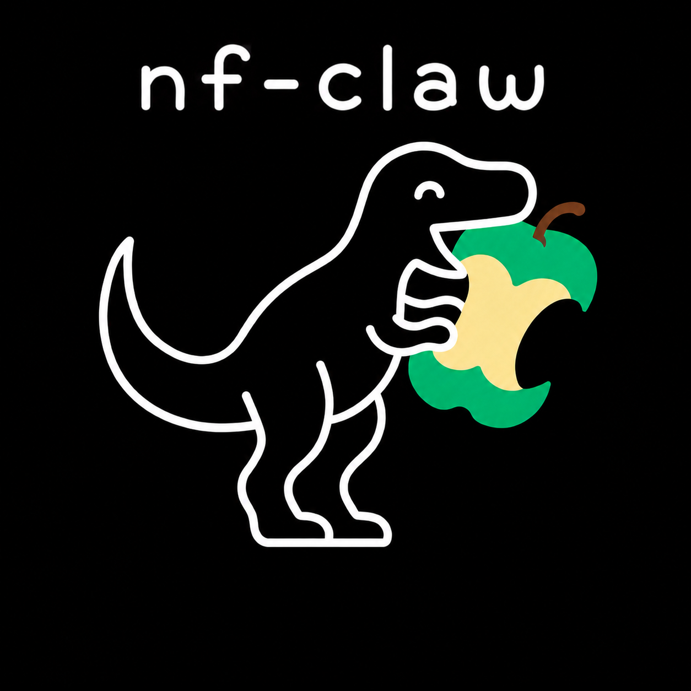

<p align="center">
  
</p>

<p align="center">
  <a href="LICENSE"></a>
  <a href="https://www.python.org/downloads/"></a>
  <a href="https://nextflow.io"></a>
  <a href="https://nf-co.re"></a>
  <a href="https://danilomonge.github.io/nf-claw/"></a>
</p>

# nf-claw

A self-maintaining, token-minimal library of [nf-core](https://nf-co.re) pipelines curated for AI agents and bioinformaticians. Each pipeline is wrapped unmodified as a pinned git submodule accompanied by an auto-generated `skill.md` describing its declared inputs, parameters, and run commands. The pinned release validates and executes the analysis with zero manual wrapping overhead.

**🌐 Live Portal: [danilomonge.github.io/nf-claw](https://danilomonge.github.io/nf-claw/)** — an interactive digital interface to the entire library (pipeline explorer, parameters, architecture documentation, and live automation status), rebuilt continuously from the repository.

---

### Navigation

[Repository Layout](#layout) • [Quickstart](#quickstart) • [Provenance, Replay & Verification](#provenance-replay--verification) • [Maintenance](#maintain) • [Adding Pipelines](#adding-pipelines) • [Continuous Automation](#how-it-stays-current) • [Scientific Validation](#scientific-validation--limitations) • [Citations](#citation--attribution)

---

## Layout

The repository is structured into four functional zones:

| Path | Component | Description |
|---|---|---|
| `pipelines/<name>/` | **Library Content** | `upstream/` (submodule pinned to a release) + generated `skill.md` (agent instructions, run commands, inputs, required parameters with constraints) and `reference.md` (complete schema catalog). |
| `runner/` | **Execution Engine** | The `nfclaw` CLI runtime handling parameter preflight, environment isolation, provenance generation, replay guards, and multi-stage chaining. |
| `librarian/` | **Maintenance Automation** | Tools for building context files, auditing schema drift, bumping releases, and discovering new DSL2 pipelines (`make build`, `make check`). |
| `handoffs/` | **Chaining Rules** | Declarative rules (`handoffs/<upstream>/<downstream>.json`) mapping outputs between sequential pipeline stages, statically verified by the drift gate. |
| `catalog.md` / `.json` | **Pipeline Catalog** | Auto-compiled index detailing declared inputs, conditional outputs, upstream descriptions, and citations for all tracked pipelines. |
| `sources.tsv` | **Release Manifest** | Registry mapping pipeline names to upstream remotes and version tracking policies (`latest-release`). |

### Documentation Guides

| Topic | Document | Scope & Contents |
|---|---|---|
| **Architecture** | [`docs/architecture.md`](docs/architecture.md) | Architectural zones, schema preflight, sibling file locks, and provenance structure. |
| **Engine Compatibility** | [`docs/compatibility.md`](docs/compatibility.md) | DSL2 enforcement, Nextflow 25 vs 26 parser transition, and `--nxf-ver` controls. |
| **Pipeline Chaining** | [`docs/chaining.md`](docs/chaining.md) | Multi-stage orchestration, spec schemas, handoff transforms, and lineage verification. |
| **Known Issues** | [`docs/known-issues.md`](docs/known-issues.md) | Host environment troubleshooting, benign Nextflow warnings, and upstream workarounds. |
| **Updating & Drift** | [`docs/updating.md`](docs/updating.md) | GitHub Actions automation, tag discovery, and strict zero-drift enforcement. |
| **Agent Guidance** | [`AGENTS.md`](AGENTS.md) / [`CLAUDE.md`](CLAUDE.md) | Authoritative reference for autonomous coding assistants and LLM agents. |

---

## Quickstart

### 1. Installation & Basic Execution

```bash
# Editable install places `nfclaw` on PATH (or use `python3 -m runner <cmd>` without installation)
pip install -e .

# List all available pipelines and descriptions
nfclaw list

# Execute a pipeline run
nfclaw run rnaseq --input samplesheet.csv --outdir results -profile docker

# Check execution status (success / running / failed / stopped without outcome)
nfclaw status results
```

> [!NOTE]
> The editable install is intentional: `nfclaw` resolves pinned submodules and generated schema context directly from the repository tree. Running outside a checked-out repository emits a clear setup error instead of an empty catalog.

### 2. Command Inspection (Dry-Run)

```bash
# Inspect the exact Nextflow command that would run without executing it
# Validates parameters, schemas, and paths without creating or modifying --outdir
nfclaw run rnaseq --input samplesheet.csv --outdir results -profile docker --check
```

### 3. Provenance Replay & Verification

```bash
# Reproduce a completed run into a fresh target directory
./results/provenance/commands.sh                         # -> results.replay/

# Verify structural equivalence against the original run
nfclaw verify results.replay --against results           # structural check (file inventory)

# Verify strict byte-identical agreement (fails on modified files)
nfclaw verify results.replay --against results --strict  # byte-level agreement check
```

### 4. Release Selection & Development Code

```bash
# List available release tags (pinned latest flagged; dev branch listed last)
nfclaw versions rnaseq

# Inspect on-demand documentation for a specific published release
nfclaw show rnaseq --pipeline-version 3.14.0

# Run a specific published release tag
nfclaw run rnaseq --pipeline-version 3.14.0 --input samplesheet.csv --outdir results -profile docker

# Run unreleased development code (head of nf-core's `dev` branch, anchored by commit SHA)
nfclaw show rnaseq --pipeline-version dev
nfclaw run rnaseq --pipeline-version dev --input samplesheet.csv --outdir results -profile docker
```

### 5. Engine Pinning & Runtime Environment

```bash
# Pin a specific Nextflow engine version (records NXF_VER in provenance)
nfclaw run rnaseq --nxf-ver 25.10.4 --input ss.csv --outdir results -profile docker

# Pass NXF_* environment variables (e.g. JVM IPv6 preferences or offline execution)
nfclaw run rnaseq --nxf-env NXF_JVM_ARGS=-Djava.net.preferIPv6Addresses=true --input ss.csv --outdir results -profile docker
```

### 6. Pipeline Chaining

```bash
# Discover supported downstream handoffs for a pipeline
nfclaw chain edges fetchngs

# Preflight validate a multi-stage specification without launching processes
nfclaw chain run spec.json --outdir /abs/chain --check

# Execute a multi-stage chain (stage 1 -> stage 2 -> stage 3)
nfclaw chain run spec.json --outdir /abs/chain

# Resume a failed chain using Nextflow caching
nfclaw chain run spec.json --outdir /abs/chain --resume

# Inspect chain execution and verify cryptographic custody across all stages
nfclaw chain status /abs/chain
```

### 7. Workstation Resource Caps

```bash
# Apply a resource ceiling to prevent out-of-memory aborts on local workstations
nfclaw run rnaseq --input ss.csv --outdir results -profile docker \
  --limit-cpus 4 --limit-memory 15.GB --limit-time 1.h
```

---

## Provenance, Replay & Verification

By default, `nfclaw run` writes a provenance bundle into `<outdir>/provenance/`.
The log appends on `--resume`; metadata and checksums describe the latest attempt.
External dependencies must remain available: the bundle does not archive every input.

| Artifact | File Path | Function & Role |
|---|---|---|
| **Run Log** | `logs/run.log` | Complete launch record (host, PID, Nextflow stdout/stderr) ending with terminal outcome line: `==> nfclaw run finished <time>: <outcome>`. |
| **Replay Script** | `commands.sh` | Replays the recorded analysis into a fresh directory (default `<outdir>.replay`), with dependency guards and a fixed engine version; it does not resume the original attempt. |
| **Dependency Guard** | `replay_guard.py` | Pre-flight validator executed by `commands.sh` verifying that pipeline commits, inputs, samplesheets, and configs match recorded SHA-256 digests. |
| **Run Manifest** | `run_manifest.json` | Pipeline version, commit SHA, command, recording timestamp, outcome, observed engine version and environment settings. |
| **Parameter File** | `params.json` | Resolved wrapper parameters passed to Nextflow. Additional defaults or profile values can be recorded separately by the upstream pipeline. |
| **Checksum Manifests** | `inputs.sha256` / `outputs.sha256` | Cryptographic digests of declared local inputs and generated result files; remote inputs are not frozen by these manifests. |
| **Resource Limits** | `resource_limits.config` | Nextflow `process.resourceLimits` configuration generated when `--limit-*` flags are specified. |

> [!IMPORTANT]
> **Run Isolation & Sibling File Locking:** On POSIX systems, `nfclaw run` holds an exclusive non-blocking sibling flock (`.{outdir.name}.nfclaw.lock`) across the execution lifecycle. Overlapping or concurrent runs targeting the same output directory fail fast with `ErrorCode.ENVIRONMENT`, eliminating race conditions and cache corruption.

---

## Maintain

Repository context and validation are managed via standard `make` targets:

```bash
make build     # Regenerate skill.md, reference.md, and catalog.* from pinned submodules
make update    # Bump submodules to newest release tags and rebuild context
make check     # Run schema drift gate and complete test suite
make test      # Run full pytest test suite
```

---

## Adding Pipelines

To onboard a new nf-core pipeline to the library:

1. **Register in `sources.tsv`:** Append a tab-separated entry (`<name>\thttps://github.com/nf-core/<name>.git\tlatest-release`).
2. **Add Submodule:** Check out the upstream repository and pin to an official release tag:
   ```bash
   git submodule add https://github.com/nf-core/<name>.git pipelines/<name>/upstream
   git -C pipelines/<name>/upstream checkout tags/<X.Y.Z>   # Pin to release tag (not default branch)
   ```
3. **Build Context & Verify:**
   ```bash
   make build     # Generate skill.md, reference.md, catalog.md, catalog.json
   make check     # Run schema drift gate and unit test suite
   ```

Detailed contributor standards, naming constraints, and test procedures are provided in [`CONTRIBUTING.md`](CONTRIBUTING.md).

---

## How It Stays Current

Five automated GitHub Actions workflows keep the library and website synchronized with upstream releases:

```
┌────────────────────────┐      ┌───────────────────────────┐      ┌─────────────────────────┐
│     auto-update.yml    │      │   discover-pipelines.yml  │      │     deploy-pages.yml    │
│  Daily tag discovery   │      │   Weekly DSL2 discovery   │      │ Rebuild & deploy portal │
│   & acceptance gating  │      │  & strict exit-code 0 gate│      │    on push to main      │
└────────────────────────┘      └───────────────────────────┘      └─────────────────────────┘
               │                              │                                 │
               └──────────────────────┬───────┴─────────────────────────────────┘
                                      ▼
                      ┌───────────────────────────────┐
                      │    Continuous Verification    │
                      │  • smoke.yml (preflight)      │
                      │  • nextflow-validate.yml (DAG)│
                      └───────────────────────────────┘
```

- **`auto-update.yml`** (Daily): Discovers new upstream release tags via `git ls-remote --tags`, checks out new versions, regenerates context files, verifies Nextflow acceptance (`nextflow -preview`), runs the test suite and drift gate, and auto-merges the update.
- **`discover-pipelines.yml`** (Weekly): Identifies newly published **DSL2** nf-core pipelines, scaffolds submodules, enforces strict exit code 0 acceptance, and merges validated pipelines.
- **`deploy-pages.yml`** (Push to `main`): Rebuilds and publishes the interactive static portal to GitHub Pages.
- **`smoke.yml`** (Weekly & on changes): Validates command synthesis, schema parsing, and CLI arguments across all pipelines (`nfclaw run --check --demo`).
- **`nextflow-validate.yml`** (Nightly & on changes): Executes `nextflow -preview` under pinned minimum Nextflow versions to verify pipeline compilation, profile resolution, schema validation, and DAG construction.

Further details on drift prevention and update automation: [`docs/updating.md`](docs/updating.md).

---

## Scientific Validation & Limitations

> [!WARNING]
> **Analytical Rigor & Validation Caveats:**
> nf-claw validates declared inputs, checks parameters against schemas, assembles commands, isolates execution environments, and tracks cryptographic provenance. Successful parameter validation, exit code 0 completion, or identical output file structures do not inherently establish biological or analytical accuracy.
>
> Prior to relying on results in production scientific research:
> 1. Validate chosen pipelines, parameters, and reference genomes using domain-appropriate benchmark datasets.
> 2. Use `nfclaw verify ... --strict` to verify byte agreement; employ format-aware bioinformatics tools to inspect numerical differences.
> 3. Consult [known issues](docs/known-issues.md) for documented engine boundaries, upstream workarounds, and runtime guidance.

---

## Citation & Attribution

**The pipelines themselves are the work of the [nf-core](https://nf-co.re) community** — the heart of this library. Pipelines are wrapped **unmodified** as pinned git submodules; each maintains its own authors, license, and citations.

**nf-claw** was created by **Danilo Monge** (Eberhard Karls Universität Tübingen) and adapts architectural concepts and repository structures from [ClawBio](https://clawbio.ai) — created by **Manuel Corpas** (MIT; copyright retained in [`LICENSE`](LICENSE), provenance in [`NOTICE`](NOTICE)).

When utilizing nf-claw in scientific research, cite via [`CITATION.cff`](CITATION.cff), alongside its foundational technologies:
- **Nextflow:** Di Tommaso P, *et al.* Nextflow enables reproducible computational workflows. *Nat Biotechnol* **35**, 316–319 (2017). [doi:10.1038/nbt.3820](https://doi.org/10.1038/nbt.3820)
- **nf-core:** Ewels PA, *et al.* The nf-core framework for community-curated bioinformatics pipelines. *Nat Biotechnol* **38**, 276–278 (2020). [doi:10.1038/s41587-020-0439-x](https://doi.org/10.1038/s41587-020-0439-x)
- **Executed Pipeline:** Cited individually in `pipelines/<name>/upstream/CITATIONS.md`.
- **ClawBio:** Corpas M. ClawBio: Bioinformatics-Native AI Agent Skill Library. Zenodo (2026). [doi:10.5281/zenodo.19420648](https://doi.org/10.5281/zenodo.19420648)

nf-claw is MIT-licensed (© Danilo Monge) and includes components adapted from ClawBio (© Manuel Corpas, MIT — see [`LICENSE`](LICENSE) and [`NOTICE`](NOTICE)). Upstream nf-core pipelines are MIT-licensed, and Nextflow is Apache-2.0.

**System Requirements:** Python 3.11+, git, Nextflow (Java 17+), Docker or Singularity.
